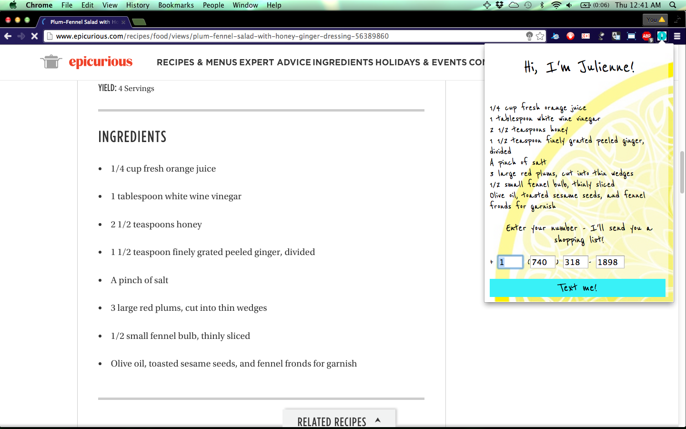

Hello, I'm Julienne!
=====================

Julienne is a Chrome extension that makes it incredibly easy to grab the ingredients listed in a recipe and makes it easy for you to add them to your shopping list.

Currently, Julienne can text you the ingredients, and in future we plan to also support saving the ingredients to the cloud (e.g. Google Drive).

Here is what Julienne looks like:

